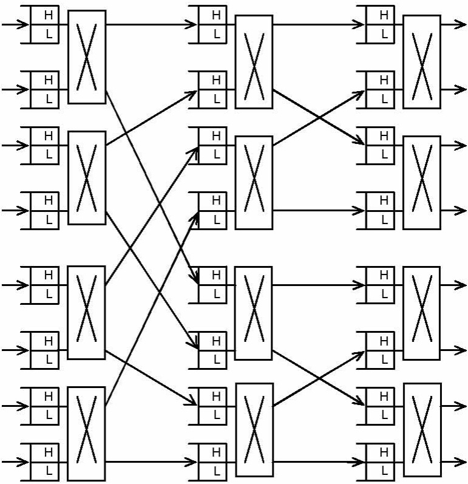

# Two-priority Network Simulation

A simulation of this work:

[Performance Evaluation of Two-Priority Network Schema for Single- Buffered Delta Networks](https://ieeexplore.ieee.org/document/4394153)

in which a switching fabric architecture that natively supports a dual-priority scheme is proposed, aiming to improve the QoS offered to high-priority packets. 

## System Architecture

In the proposed scheme, each SE has two transmission queues per link, with one queue dedicated to high priority packets and the other dedicated to low priority ones.

During a single network cycle, the SE considers all its links, examining for each one of them firstly the high priority queue. If this is not empty, it transmits the first packet towards the next MIN stage; the low priority queue is checked only if the corresponding high priority queue is empty.

Packets in all queues are transmitted in a first come, first served basis.

## Simulation Results

The performance of the proposed scheme was evaluated through simu- lation experiments, and compared to the performance of single-priority MINs.

In the below figures, on the left are the simulation results in the original work, on the right are the simulation results of ours.

